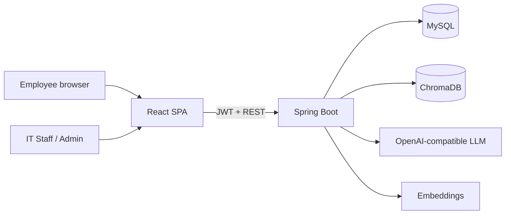

# AI-Powered Enterprise IT Helpdesk Agent

Full-stack helpdesk for a company like **Northwind**: employees chat with an AI that may answer **only** from approved IT documents. If retrieval is weak, the system **does not guess**. It classifies the issue, suggests a priority, and **opens a support ticket** for IT Staff.

This project is built to be demoable on a laptop and easy to walk through in a Java / React / RAG interview.

## What you get in this folder

```
ai-it-helpdesk/
├── docker-compose.yml          MySQL 8 + ChromaDB
├── .env.example                Optional OpenAI key
├── backend/                    Spring Boot 3.4, Java 17, JWT, RAG
├── frontend/                   React 18, Vite, Axios, React Router
└── README.md                   This architecture guide
```

## Demo accounts (seeded on first boot)

| Role | Email | Password |
|---|---|---|
| Employee | `employee@helpdesk.local` | `Password@123` |
| IT Staff | `itstaff@helpdesk.local` | `Password@123` |
| Admin | `admin@helpdesk.local` | `Password@123` |

## How to run (local demo)

You need **Java 17**, **Maven**, **Node 18+**, and **Docker Desktop**. Install them and ensure `java`, `mvn`, `node`, and `npm` are on your PATH (Eclipse / IntelliJ can also run `HelpdeskApplication` without Maven on the PATH).

### 1. Start MySQL and ChromaDB

```bash
cd ai-it-helpdesk
docker compose up -d
```

Wait until MySQL is healthy (`docker compose ps`).

### 2. Start the Spring Boot API

```bash
cd backend
mvn spring-boot:run
```

API: http://localhost:8080/api/health

On startup the backend:

- creates tables in MySQL (`ddl-auto: update`)
- seeds the three demo users (passwords stored with **BCrypt**)
- ingests eight sample knowledge-base articles (VPN, password/MFA, email, printer, Wi-Fi, hardware, access, software)
- chunks them, embeds them, stores chunks in **MySQL** and vectors in **ChromaDB** (if Chroma is up)

### 3. Start the React UI

```bash
cd frontend
npm install
npm run dev
```

UI: http://localhost:5173 (Vite proxies `/api` to port 8080)

Optional: copy `.env.example` and set `OPENAI_API_KEY` before starting the backend. Without a key, the app still runs using **feature-hash embeddings** and a **grounded extractive answer**. With a key, it uses OpenAI embeddings + `gpt-4o-mini` JSON answers.

### Interview demo script

1. Login as **employee**. Ask: `How do I connect to the corporate VPN from home?`  
   You should get steps from the VPN guide (gateway `vpn.northwind.internal`, MFA, Software Center).
2. Ask something **not** in the KB: `How do I deploy our payroll microservice to Kubernetes?`  
   The assistant should refuse to invent an answer and **create a ticket**.
3. Open **My tickets** and show summary, symptoms, troubleshooting, KB context, category, priority.
4. Login as **IT Staff**. Assign, comment, move status to IN_PROGRESS → RESOLVED → CLOSED.
5. Login as **Admin**. Show analytics, users, knowledge-base upload (PDF/DOCX/TXT/MD).

## Default company files (knowledge base)

You do **not** have to upload the eight sample runbooks by hand for a demo.

They live in `backend/src/main/resources/kb-samples/` (copies also in `knowledge-base/`). When the backend starts, `DataSeeder` indexes any default file that is not already in MySQL.

If the Knowledge base page is empty (for example the first start failed, or you deleted the files):

1. Sign in as `admin@helpdesk.local`
2. Open **Knowledge base**
3. Click **Load default company documents**

That calls `POST /api/admin/kb/defaults`. Already-indexed names are skipped, so it is safe to click more than once.

To add **your real company** policies: use **Upload and index** with PDF, DOCX, TXT, or MD. Put extra built-in files in `kb-samples` if you want them to load automatically on every new database.

---

## Architecture (simple words)



| Piece | Why it is here |
|---|---|
| **React** | Chat UI and three role dashboards. Axios calls REST. React Router switches pages. |
| **Spring Boot** | REST APIs, validation, file upload, business rules. |
| **Spring Security + JWT** | Stateless login. Token carries email and role. |
| **BCrypt** | Passwords are hashed. Never stored in plain text. |
| **MySQL** | Users, roles, conversations, messages, tickets, comments, KB files and chunk text. |
| **ChromaDB** | Vector store: each chunk + embedding + metadata (`documentId`, `sourceName`). |
| **Embeddings** | Turn text into numbers so “VPN from home” matches “Cisco Secure Client gateway”. |
| **RAG** | Retrieve approved chunks **first**, then ask the LLM to answer **only** from those chunks. |
| **Tickets** | Human fallback when RAG confidence is too low. |

RAG in one sentence: **search the company documents, then generate**. The model is not allowed to use the open internet as a source of truth.

---

## MySQL tables

Hibernate creates these on startup:

| Table | Purpose |
|---|---|
| `users` | Email, BCrypt hash, name, department, role (`EMPLOYEE`, `IT_STAFF`, `ADMIN`), enabled flag |
| `conversations` | One AI chat thread per employee |
| `messages` | User/assistant text, predicted category/priority, RAG flag, escalated flag |
| `tickets` | Number, employee, assignee, title, summary, symptoms, troubleshooting, KB context, category, priority, status, source (`AI_ESCALATION` or `MANUAL`) |
| `ticket_comments` | Work notes from employee or IT |
| `kb_documents` | Uploaded file metadata and chunk count |
| `kb_chunks` | Actual text pieces (backup retrieval if Chroma is down) |

**Ticket status:** `OPEN` → `ASSIGNED` → `IN_PROGRESS` → `RESOLVED` → `CLOSED`  
**Priority:** `LOW`, `MEDIUM`, `HIGH`, `CRITICAL`  
**Category:** `HARDWARE`, `SOFTWARE`, `NETWORK`, `VPN`, `EMAIL`, `PASSWORD`, `PRINTER`, `ACCESS`, `OTHER`

---

## REST APIs

| Method | Path | Who | What |
|---|---|---|---|
| POST | `/api/auth/login` | Public | Email + password → JWT |
| GET | `/api/auth/me` | Any logged-in user | Current profile |
| GET | `/api/health` | Public | Liveness |
| GET/POST | `/api/chat/conversations`, `/api/chat/ask` | Logged-in | Conversations and RAG ask |
| GET/POST | `/api/tickets` | Employee sees own; staff sees all | List / create |
| POST | `/api/tickets/{id}/comments` | Owner or staff | Comment |
| GET/PATCH | `/api/staff/tickets`, `.../assign`, `.../status` | IT_STAFF, ADMIN | Queue operations |
| CRUD | `/api/admin/users`, `/api/admin/kb` | ADMIN | Users and documents |
| GET | `/api/admin/analytics` | ADMIN | Counts and breakdowns |

Authorization is role-based: `/api/admin/**` needs `ROLE_ADMIN`, `/api/staff/**` needs `ROLE_IT_STAFF` or `ROLE_ADMIN`. JWT filter sets `ROLE_<enum>`.

---

## RAG pipeline (the interview heart)

1. **Upload (Admin)**  
   File lands on disk. PDFBox reads PDF, Apache POI reads DOCX, UTF-8 reads TXT/MD.

2. **Chunk**  
   About 900 characters with 150 overlap, preferably on sentence boundaries. Small chunks retrieve more precisely; overlap keeps a sentence from being split awkwardly.

3. **Embed**  
   If `OPENAI_API_KEY` is set: `text-embedding-3-small`.  
   Else: **feature hashing** into 384 dimensions (same words → same buckets). Good enough for a local demo and easy to explain.

4. **Store**  
   - MySQL `kb_chunks` = the text  
   - Chroma collection `enterprise_it_kb` = ids + embeddings + documents + metadata  
   Cosine space so distance `d` ≈ `1 - similarity`.

5. **Ask (Employee)**  
   Embed the question → Chroma `query` top 5. If Chroma is down, score all MySQL chunks with cosine + word overlap.

6. **Ground the LLM**  
   System prompt: answer **only** from context; if missing, `sufficientKnowledge=false`.  
   Similarity below `app.rag.min-similarity` (0.32) also forces escalation.

7. **Escalate**  
   Creates a ticket with:
   - problem summary  
   - symptoms (the question)  
   - troubleshooting already attempted (AI consultation)  
   - relevant KB snippets and scores  
   - suggested category and priority  

The assistant **must not hallucinate** payroll Kubernetes steps if those docs were never uploaded.

---

## Important backend classes

| Class | Plain-English job |
|---|---|
| `SecurityConfig` | CSRF off (JWT API), CORS, which URLs are public |
| `JwtAuthFilter` | Reads `Authorization: Bearer ...`, loads user, sets Spring authentication |
| `ChatService` | Saves messages, calls RAG + LLM, maybe opens a ticket |
| `RagService` | Retrieve chunks; decide if knowledge is sufficient |
| `LlmService` | OpenAI JSON or extractive fallback + keyword classification |
| `KnowledgeBaseService` | Ingest → chunk → embed → Chroma upsert |
| `TicketService` | Assign, status, comments, ticket numbers `HD-YYYYMMDD-####` |
| `DataSeeder` | Demo users + sample KB |

Classification without an LLM still works: VPN/password/email/printer keywords map to categories; words like “outage” / “production down” raise priority to CRITICAL.

---

## Frontend map

| Route | Role | Screen |
|---|---|---|
| `/login` | Public | Sign-in |
| `/app` | All | AI chat |
| `/app/tickets` | Employee | Own tickets + manual create |
| `/staff` | IT Staff / Admin | Queue + stats |
| `/admin` | Admin | Analytics |
| `/admin/users` | Admin | Create / disable users |
| `/admin/kb` | Admin | Upload / delete documents |

---

## Design choices you can defend in an interview

- **MySQL + Chroma, not one database:** relational data needs transactions and roles; vectors need ANN search.
- **Chunks also in MySQL:** demo still works if Chroma is stopped; easier to inspect in Workbench.
- **No guessing:** retrieval threshold + prompt + ticket path.
- **JWT not sessions:** API scales; React stores token in `localStorage` (fine for a demo; httpOnly cookies are the production upgrade).
- **BCrypt + method security:** standard Spring interview answer.
- **OpenAI optional:** you can demo offline.

Production follow-ups (mention if asked): httpOnly cookies, SSO, virus scan uploads, PII redaction, audit log, rate limits, evaluation set for RAG quality, hybrid search (BM25 + vectors).

## License

Built as a portfolio / interview demonstration. Sample policies are fictional Northwind IT runbooks.
